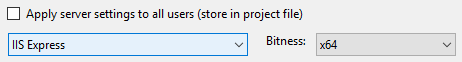
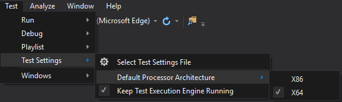

Augurk
======

Augurk is an always improving, open source, living documentation system designed to get maximum value out of [Gherkin](https://github.com/cucumber/cucumber/wiki/Gherkin)-based specifications. By continuously listening to the struggles and desires of various agile teams, Augurk aims to be the most natural fit for anyone wishing to publish their living documentation.

Augurk provides an accessible, easy-to-use overview of all the features describing your application(s) on a webportal you can host within your own organization.

## Inspiration ##
Augurk is greatly influenced by [Relish](https://www.relishapp.com/)
and [Pickles](http://www.picklesdoc.com/). While Relish is a great SaaS application,
it requires you to publish your documentation to the cloud. While this is not an issue when your sources live in the cloud as well,
in other cases it is often still preferable to keep the documentation within the corporate intranet.  
This leaves Pickles. Although Pickles adresses the cloud issue (it was designed for that purpose), it has
some short-comings of its own. Pickles generates a neat (Dynamic)HTML website for each project/solution you
require it to. It does, however, not incorporate these. This means not only will you get a website for each solution,
you can multiply your number of websites with the number of branches you maintain simultaneously.

Augurk has been designed to address exactly these issues. It allows you to publish your
features from multiple solutions and branches to a single location, providing you with a single access-point
for all your documentation. While Augurk is based upon the same principles as Pickles, it has 
been rebuild completely from the ground-up, allowing Augurk to provide all the same functionality but simultenously
improving and extending it where necessary.

### Augurk? ###
The *Gherkin* language is used to write *Cucumber* specifications. 
Seeing as a *Gherkin* is a pickled cucumber, the naming of *Pickles*
and *Relish* (a pickled food item) make perfect sense. Since that doesn't leave much
*Gherkin* related terms in the English language, it was an almost natural choice to switch
to a different language. Since *Augurk* is being developed in The Netherlands, 
*Augurk* (meaning pickle[d cucumber]) was a perfect fit.

## How to set up your development environment ##
Great, you want to open our jar of augurk's!  
Let's us help you set up the development environment, there are 3 steps to get you up and running.
1. First you'll need *Visual Studio 2015* or newer to open the solution
1. On the `Augurk` project, change the *IIS Express* bitness to x64  

1. Change the bitness of the *Test Runner* to x64  

Now you should be able to run and test all code.

Just as a note, the feature files that are part of the `Augurk.Specification` project are not implemented. Therefore, when you run all tests in the solution they will be skipped.